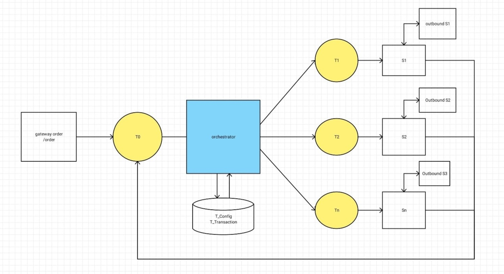

# Golang Youtube Transaction Mircoservice

## Table of Content
- [Description](#description)
- [Mind map](#mind-map)
- [Features](#features)
- [Tech Stack](#tech-stack)
- [Run locally](#run-locally)

## Description
This project is a mock of transaction of what usually occurs at live streaming service. For this one i selected Youtube. This project only focused at the order orchestration hence why it doesn't fully mock or have feature like Youtube usually has.

## Mind Map
This project structure is roughly like this

The flow goes basically like this:
1. The order comes from gateway/order-service which then will store the order created by user when hitting the order API
2. The order service will then create a topic to be sent to orchestration
3. Orchestration service received the order and checking the order type from config table to receive steps to go over until the order marked as completed
4. Orchestration will then create topic for the Sn service receive and then process the message.
5. The received message is checked again what order type is asked for. After that the Sn service will sent http request to outbound service to get the response and create the topic again in Sn service for orchestration.
6. The orchestration received the message from Sn service and checked the content whether the request is success or failed.
7. If the request succeded then go over to the next step.
8. Repeat the process until next step is empty.

> [!NOTE]
> The outbound service in this project is only for mocking even if it used map for the storage.

### Order flow
This program have 2 types of order, membership and donation.
For donation I build a sequence diagram for user to be understand which step need to be visited until the order is marked as completed (this sequence diagram only describes the positive case only).

### Order type = Membership


### Order type = Donation


## Features
Like the Mind Map explained above, this program have 2 types of order: membership and donation. This program also have additional feature like:
1. Rollback
2. Automatic Retry
3. Edit retry

### Rollback
Rollback here is an automated feature. The rollback will be triggered if user's balance has been deducted from balance service but other step after the balance deducted resulting a failure thus returning the user's balance to normal.

### Automatic Retry
Automatic retry is triggered if an outbound service returning a response with retryable status code. The retryable status code is based on this [article](https://developer.doordash.com/en-US/docs/drive/reference/retry_pattern/). It also have backoff time for each retry with max retry is set to 3.

### Edit Retry
Edit retry is considered admin privilage hence why it is put a feature in orchestration service. Edit retry is triggerable if outbound service returnin a response with not retryable status code or max retry reached. Edit retry need the admin know the transaction detail id which the step is failed. Admin able to find the step which failed by triggering Find Transaction Detail By Transaction ID Status Failed endpoint in orchestration service.

## Tech Stack
Tech stack used in this project is
1. [Go](https://go.dev/)
2. [Gin](https://gin-gonic.com/)
3. [PostgreSQL](https://www.postgresql.org/)
4. [Apache Kafka](https://kafka.apache.org/)
5. [Segmentio Kafka Client](https://github.com/segmentio/kafka-go) (kafka client for go)
6. [Zerolog](https://github.com/rs/zerolog) (logging tool)
7. [Make (or usually called Makefile)](http://ftp.gnu.org/gnu/make/) (optional)

## Run Locally
You can run this project in your computer by cloning this project and make sure you have this programs installed
1. [PostgreSQL](https://www.postgresql.org/)
2. [Go](https://go.dev/)
3. [Apache Kafka](https://kafka.apache.org/)

After that you can follow this steps:
1. Connect to your PostgreSQL server
2. Create database and put that database config and name in .env file for order and orchestration service
3. Open terminal and change the directory to each service and run
```bash
go mod tidy
```
4. Create config table and seed it with this:
```sql
CREATE TABLE transaction_config (
	id INTEGER GENERATED ALWAYS AS IDENTITY PRIMARY KEY,
	order_type VARCHAR(255) NOT NULL,
	service_source VARCHAR(255) NOT NULL,
	service_dest VARCHAR(255) NOT NULL,
	action VARCHAR(255) NOT NULL,
	status_category VARCHAR(255) NOT NULL
);

INSERT INTO transaction_config
(order_type, service_source, service_dest, action, status_category)
VALUES
('membership', 'orchestration', 'user-source', 'VALIDATE USER SOURCE', 'SUCCESS'),
('membership', 'user-source', 'balance-source', 'DEDUCT BALANCE', 'SUCCESS'),
('membership', 'balance-source', 'channel', 'VALIDATE CHANNEL', 'SUCCESS'),
('membership', 'channel', 'user-dest', 'VALIDATE USER DEST', 'SUCCESS'),
('membership', 'user-dest', 'balance-dest', 'ADD BALANCE', 'SUCCESS'),
('membership', 'user-source', 'balance-source', 'ADD BALANCE', 'FAILED'),
('donation', 'orchestration', 'user-source', 'VALIDATE USER SOURCE', 'SUCCESS'),
('donation', 'user-source', 'balance-source', 'DEDUCT BALANCE', 'SUCCESS'),
('donation', 'balance-source', 'donation', 'VALIDATE DONATION PROVIDER', 'SUCCESS'),
('donation', 'donation', 'channel', 'VALIDATE CHANNEL', 'SUCCESS'),
('donation', 'channel', 'user-dest', 'VALIDATE USER DEST', 'SUCCESS'),
('donation', 'user-dest', 'balance-dest', 'ADD BALANCE', 'SUCCESS'),
('donation', 'user-source', 'balance-source', 'ADD BALANCE', 'FAILED'),
```
5. For transaction and transaction detail table, copy and paste this sql create table script below:
```sql
CREATE TABLE transaction (
	id INTEGER GENERATED ALWAYS AS IDENTITY PRIMARY KEY,
	transaction_id VARCHAR(255) NOT NULL,
	order_type VARCHAR(255) NOT NULL,
	user_id INTEGER NOT NULL,
	status VARCHAR(255) NOT NULL,
	created_at TIMESTAMP DEFAULT CURRENT_TIMESTAMP,
	updated_at TIMESTAMP DEFAULT CURRENT_IIMESTAMP
);

CREATE TABLE transaction_detail (
	id INTEGER GENERATED ALWAYS AS IDENTITY PRIMARY KEY,
	transaction_id VARCHAR(255) NOT NULL,
	order_type VARCHAR(255) NOT NULL,
	user_id INTEGER NOT NULL,
	topic VARCHAR(255) NOT NULL,
	action VARCHAR(255) NOT NULL,
	service VARCHAR(255) NOT NULL,
	status VARCHAR(255) NOT NULL,
	status_code INTEGER,
	message VARCHAR(255),
	payload JSONB,
	created_at TIMESTAMP DEFAULT CURRENT_TIMESTAMP
);
```
5. I have set the kafka to create topic if not exist so you can just run all the service using Makefile or run it individually
> [!WARNING]
> Using Makefile to run all the service can sometimes make service that can consume message error since they need zookeeper and kafka running first before the kafka client can run correctly. So for caution either edit the make file to not include zookeeper and kafka server or run all the service including zookeeper and kafka server manually
